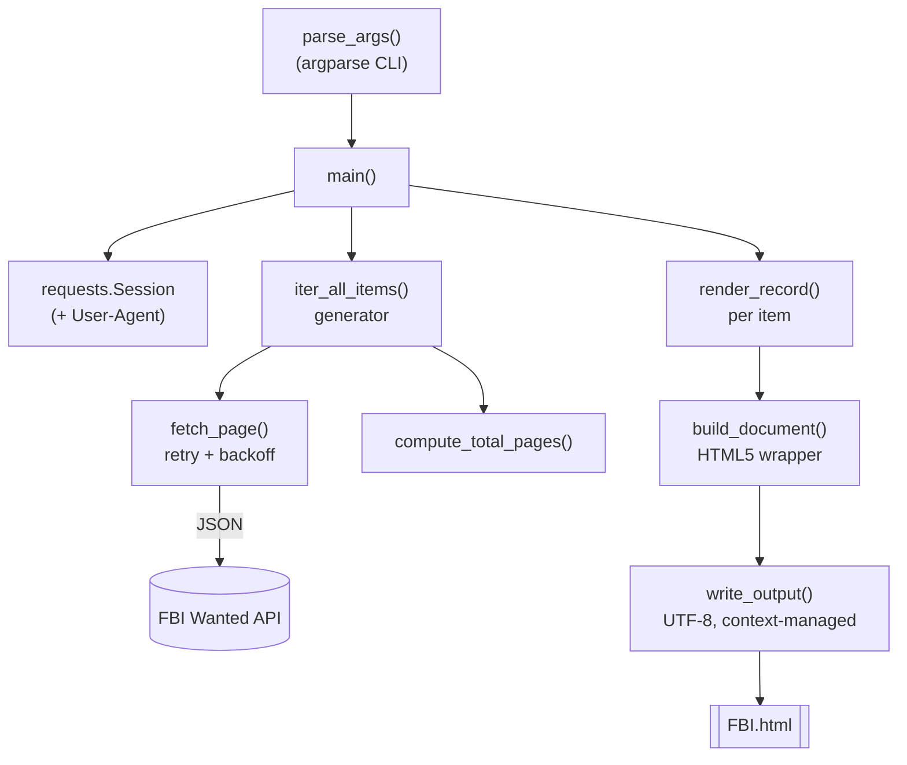

# Architecture

## System Diagram

## Component Descriptions

The entire program lives in a single module, `FBI.py`, decomposed into focused functions with clear boundaries so each can be unit-tested in isolation.

### Fetch layer
- **Purpose**: Talk to the FBI Wanted API and survive transient failures.
- **Location**: `FBI.py` — `fetch_page()`
- **Key responsibilities**: Issue one GET per page with a timeout, raise on non-2xx, parse JSON, and retry with exponential backoff (1s/2s/4s). Returns `None` after exhausting retries so callers can skip a bad page rather than abort the run.

### Pagination layer
- **Purpose**: Cover the whole dataset without hardcoding its size.
- **Location**: `FBI.py` — `iter_all_items()`, `compute_total_pages()`
- **Key responsibilities**: Fetch page 1, read the API's reported `total`, compute the page count, then yield every item across all pages. Skips failed pages, stops early on an empty page, and throttles between requests.

### Rendering layer
- **Purpose**: Turn raw item dicts into HTML safely.
- **Location**: `FBI.py` — `render_record()`, `build_document()`
- **Key responsibilities**: `render_record()` reads each field defensively and emits an `<article>`, omitting absent fields; `build_document()` wraps the articles in a complete, styled HTML5 document.

### I/O + orchestration layer
- **Purpose**: Configuration, wiring, and durable output.
- **Location**: `FBI.py` — `parse_args()`, `main()`, `write_output()`
- **Key responsibilities**: Parse flags, configure logging, drive the pipeline, and write the result as UTF-8 through a context manager. `main()` returns a process exit code (`0` success, `1` on write failure).

## Data Flow

1. `main()` parses CLI flags and opens a `requests.Session` with a descriptive `User-Agent`.
2. `iter_all_items()` fetches page 1, derives the page count from the API `total`, and lazily yields each fugitive record across all pages.
3. Each record is passed through `render_record()` into an HTML `<article>` string.
4. Non-empty articles are wrapped by `build_document()` into a full HTML5 page.
5. `write_output()` writes the page to disk as UTF-8; `main()` returns an exit code.

## External Integrations

| Service | Purpose | Notes |
|---------|---------|-------|
| FBI Wanted API (`api.fbi.gov/wanted/v1/list`) | Source of all fugitive records | Public, unauthenticated; paginated via `page`/`pageSize`; reports a `total` count |

## Key Architectural Decisions

### Generator-based pagination over an accumulating list
- **Context**: The list spans dozens of pages (~1,100+ records at time of writing).
- **Decision**: `iter_all_items()` is a generator that yields records one at a time.
- **Rationale**: Streaming keeps memory flat and lets rendering begin without buffering the entire dataset. An eager "fetch all then process" approach was rejected as unnecessary for a pipeline that consumes items linearly.

### Skip-and-continue on page failure, not abort
- **Context**: A public API will occasionally time out or return a transient error mid-run.
- **Decision**: A page that fails all retries yields `None`, and the loop skips it; only a failed *first* page aborts.
- **Rationale**: Producing a near-complete page beats producing nothing. Backoff already absorbs brief blips; skipping handles the rest.

### Derive page count from the API `total`
- **Context**: The original script hardcoded a fixed page range and silently dropped everything beyond it.
- **Decision**: Read `total` from the first response and compute the page count (`compute_total_pages`).
- **Rationale**: The dataset changes over time; a hardcoded bound is wrong the moment the list grows. Falling back to "stop on empty page" covers the case where `total` is missing or null.

### Selective HTML escaping
- **Context**: API fields mix plain text (`title`, `subjects`) with pre-formatted HTML (`caution`).
- **Decision**: HTML-escape the plain-text fields; pass the `caution` HTML through as-is.
- **Rationale**: Escaping plain text keeps the document well-formed and avoids broken markup from stray `&`/`<`; the `caution` field is intentionally rendered as the HTML the API provides.

### Single-module design
- **Context**: The whole program is under 200 lines.
- **Decision**: Keep everything in `FBI.py` as discrete functions rather than splitting into packages.
- **Rationale**: At this size, function-level separation gives full testability without the overhead of a multi-file layout.
